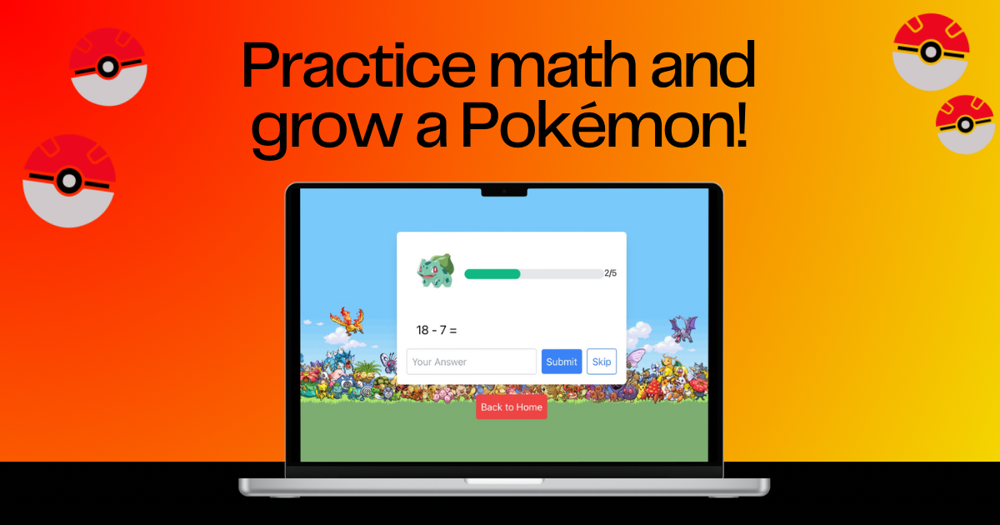

# 🎮 PokeMath | Pokémon-themed Math Game

A fun and educational Math Pokémon Game where kids can practice math questions and help their Pokémon evolve. Suitable for 1st to 4th grade levels.



## 📚 Table of Contents

- [Game Description](#game-description)
- [Features](#features)
- [How to Play](#how-to-play)
- [Installation](#installation)
- [Technology Stack](#technology-stack)
- [Project Structure](#project-structure)
- [Contributing](#contributing)
- [License](#license)
- [Acknowledgements](#acknowledgements)

## 🎯 Game Description

PokeMath is designed to help children practice their math skills in an engaging and interactive way. Players choose their grade level, select a starter Pokémon, and answer math questions correctly to help their Pokémon evolve. The game covers 1st to 4th grade math levels and includes addition, subtraction, multiplication, and division problems.

## ✨ Features

- **📖 Grade Levels**: Choose from 1st, 2nd, 3rd, and 4th grade levels
- **⚡ Pokémon Evolution**: Answer questions correctly to help your Pokémon evolve through 3 stages
- **🧮 Math Practice**: Covers addition, subtraction, multiplication, and division
- **🎨 Interactive UI**: Fun and engaging user interface with Pokémon themes
- **💾 Progress Saving**: Your Pokémon collection and progress are saved locally
- **🔄 Reset Option**: Reset all Pokémon to start fresh anytime
- **⏭️ Skip Questions**: Skip difficult questions and try new ones
- **📊 Experience Tracking**: Visual experience bar shows progress toward evolution

## 🎮 How to Play

1. **Select Grade Level**: Choose the appropriate grade level (1st, 2nd, 3rd, or 4th grade) for your math practice
2. **Choose Your Pokémon**: Select your starter Pokémon from:
   - 🌱 **Bulbasaur** → Ivysaur → Venusaur
   - 🔥 **Charmander** → Charmeleon → Charizard
   - 💧 **Squirtle** → Wartortle → Blastoise
3. **Answer Questions**: Solve the math problems displayed on the screen
4. **Evolve Your Pokémon**: 
   - Answer **5 questions correctly** to evolve to the second stage
   - Answer **8 more questions correctly** to reach the final evolution! 🎉
5. **Skip Questions**: Use the "Skip" button if you need to try a different question
6. **Collect Them All**: Play with all three starter Pokémon to build your collection

## 🚀 Installation

### Option 1: Play Online

You can play the game directly in your browser by opening the `index.html` file, or if hosted, visit the live version.

### Option 2: Local Installation

1. **Clone the repository**:
   ```bash
   git clone https://github.com/thsnyder/PokeMath.git
   ```

2. **Navigate to the project directory**:
   ```bash
   cd PokeMath
   ```

3. **Open the game**:
   - Simply open `index.html` in your web browser
   - Or use a local server (recommended):
     ```bash
     # Using Python 3
     python -m http.server 8000
     
     # Using Node.js (if you have http-server installed)
     npx http-server
     ```
   - Then visit `http://localhost:8000` in your browser

## 🛠️ Technology Stack

- **HTML5**: Structure and markup
- **CSS3**: Styling with custom animations
- **JavaScript (Vanilla)**: Game logic and interactivity
- **Tailwind CSS**: Utility-first CSS framework (via CDN)
- **LocalStorage API**: Save game progress locally

## 📁 Project Structure

```
PokeMath/
├── index.html          # Main HTML file
├── script.js           # Game logic and functionality
├── questions.json      # Math questions for all grade levels
├── README.md           # This file
└── images/
    ├── background.png  # Game background
    ├── bulbasaur.png   # Bulbasaur sprite
    ├── ivysaur.png     # Ivysaur sprite
    ├── venusaur.png    # Venusaur sprite
    ├── charmander.png  # Charmander sprite
    ├── charmeleon.png  # Charmeleon sprite
    ├── charizard.png   # Charizard sprite
    ├── squirtle.png    # Squirtle sprite
    ├── wartortle.png   # Wartortle sprite
    ├── blastoise.png   # Blastoise sprite
    ├── pokeball.png    # Pokéball icon
    ├── pokemath-favicon.png
    ├── pokemath-social-share.png
    └── favicon/        # Favicon files for web
```

## 🤝 Contributing

We welcome contributions to improve the game! To contribute:

1. **Fork the repository**
2. **Create a new branch**:
   ```bash
   git checkout -b feature-branch
   ```
3. **Make your changes** and commit them:
   ```bash
   git commit -m "Description of your changes"
   ```
4. **Push to the branch**:
   ```bash
   git push origin feature-branch
   ```
5. **Create a Pull Request** on GitHub

### Ideas for Contributions

- Add more math questions for each grade level
- Implement new features (timer mode, difficulty levels, etc.)
- Improve UI/UX design
- Add sound effects or animations
- Create additional Pokémon or evolution paths
- Add multiplayer or leaderboard features

## 📄 License

This project is licensed under the MIT License. See the [LICENSE](LICENSE) file for more details.

## 🙏 Acknowledgements

- **Pokémon**: Pokémon images and themes are trademarks of Nintendo/Creatures Inc./GAME FREAK inc.
- **Tailwind CSS**: For the utility-first CSS framework
- **Educational Community**: For inspiration in creating engaging math practice tools

## 📧 Contact

Feel free to reach out at [tom@turbologic.io](mailto:tom@turbologic.io) if you have any questions, suggestions, or feedback. Enjoy the game!

---

**Made with ❤️ for young math learners**

